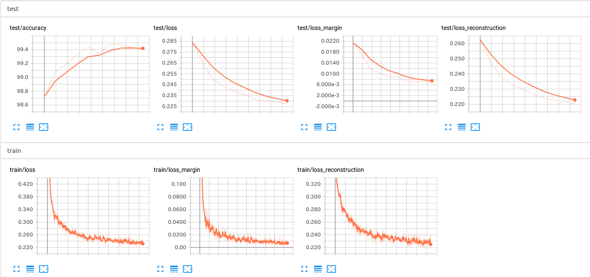

# CapsNet-PyTorch

A PyTorch implementation of CapsNet based on Geoffrey Hinton's paper [Dynamic Routing Between Capsules](https://arxiv.org/abs/1710.09829).


This figure is from [CapsNet-Tensorflow](https://github.com/naturomics/CapsNet-Tensorflow).

This implementation is forked and revised version from [motokimura's implementation](https://github.com/motokimura/CapsNet-PyTorch).
Revised points are the followings:

- Fix softmax dimension in routing.
- Initialize W in DigitCaps with uniform distribution.
- Use Conv2D(in\_channels, out\_capsules * out\_capsule\_dim) as capsule layers in PrimaryCaps, for efficient computation.
- Set initial learning rate to 0.001.
- Mask with true label in reconstruction.
- Update b\_ij with agreement for each sample.

## Requirements

- [PyTorch](http://pytorch.org/) (with CUDA)
- [TensorBoard](https://github.com/tensorflow/tensorboard)
- [tensorboard-pytorch](https://github.com/lanpa/tensorboard-pytorch)

## Usage

**Step 1.** Clone this repository

```bash
$ git clone https://github.com/motokimura/CapsNet-PyTorch.git
$ cd CapsNet-PyTorch
```

**Step 2.** Start the training

```bash
$ python main.py
```

**Step 3.** Check training status and validation accuracy from TensorBoard

```bash
# In another terminal window, 
$ cd CapsNet-PyTorch
$ tensorboard --logdir ./runs

# Then, open "http://localhost:6006" from your browser and 
# you will see something like the screenshots in the `Results` section.
```

Some training hyper parameters can be specified from the command line options of `main.py`. 

In default, batch size is 128 both for training and validation, and epoch is set to 10. 
Learning rate of Adam optimizer is set to 0.001 and is exponentially decayed every epoch with the factor of 0.9. 

For more details, type `python main.py --help`.

## Results

Some results at default training settings are shown here.

### Train & test loss



## License

[MIT License](LICENSE.txt)

## References

- [motokimura/CapsNet-PyTorch](https://github.com/motokimura/CapsNet-PyTorch)
- [timomernick/pytorch-capsule](https://github.com/timomernick/pytorch-capsule)
- [naturomics/CapsNet-Tensorflow](https://github.com/naturomics/CapsNet-Tensorflow)
- [adambielski/CapsNet-pytorch](https://github.com/adambielski/CapsNet-pytorch)
- [XifengGuo/CapsNet-Keras](https://github.com/XifengGuo/CapsNet-Keras)
